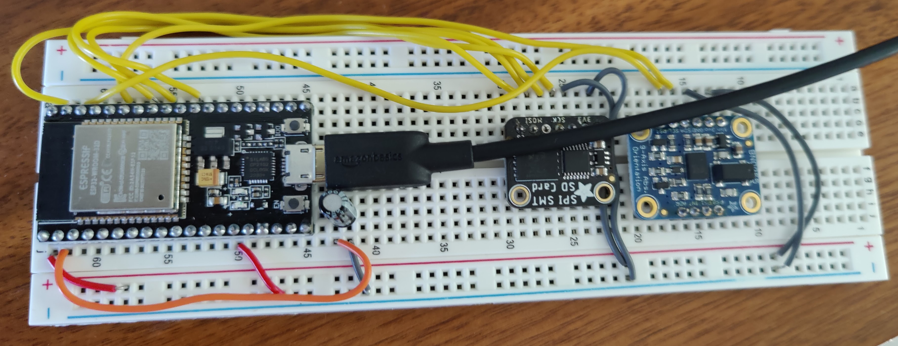

May 13, 2023
fcohen@starlingwatch.com

Reflections Air Guitar

Plays audio as board is moved up-and-down as an "air guitar"
Plays .mp3 audio files over Bluetooth A2DP to portable speakers
Requires Bluetooth Classic, so yes to ESP32, and no to ESP32S3 (BLE)

Project and source code at https://tinyurl.com/airmoe

Components
ESP32 Dev Board from HiLetGo.com
Adafruit NAND SD SPI SMT card
Adafruit BN055 9 axis accelerometer

Depends on
Arduino-Audio-Tools library 
https://github.com/pschatzmann/arduino-audio-tools
ESP32-A2DP library
https://github.com/pschatzmann/ESP32-A2DP
and
https://github.com/pschatzmann/arduino-libhelix
Accelerometer
https://github.com/adafruit/Adafruit_BNO055

Acclerometer support library
https://github.com/Seeed-Studio/Seeed_Arduino_LIS3DHTR

Uses example code from
https://github.com/pschatzmann/arduino-audio-tools/blob/main/examples/examples-basic-api/base-player-a2dp/base-player-a2dp.ino
https://github.com/pschatzmann/arduino-audio-tools/blob/main/examples/examples-player/player-sdfat-a2dp/player-sdfat-a2dp.ino
https://github.com/pschatzmann/arduino-audio-tools/blob/main/examples/examples-player/player-sd-i2s/player-sd-i2s.ino

What this does:
esp32-player-sd-a2dp

Audio file processing needed:
Open sound file in Audacity. Make sure that it contains 2 channels
- Select Tracks -> Resample and select 44100
- Export -> Export Audio -> Header Raw ; Signed 16 bit PCM

ESP32 WROOM Dev Board
Flash size: 4 MB

Pins
17 - SD NAND CS
18 - SPI Clock
19 - SPI MISO
23 - SPI MOSI

22 - SCL
21 - SDA

