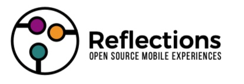

# ReflectionsOS
ESP32 and Arduino-based Internet-enabled watch project and reference architecture to make your own entertaining experiences

Many times I imagine making a mobile application connected to the Internet. For example, a watch that shows videos of my children growing-up on my wrist. And the same project is re-used for creative makers to make their own entertaining experiences. Reflections is the architecture and the wrist watch is the first application.

Reflections integrates video displays, Bluetooth, Wifi, SD storage, sound, and a bunch of sensors (compass/magnetometer, gestures, accelerometer). It is battery powered, powered managed from software, and charges from USB. It is small in size (34 mm round) and powerful from an ESP32-S3 dual core processor. Reflections software, hardware, and cloud components are open-source (GPL v3) so anyone can use it and they must contribute improvements back to the project.

Reflections goes beyond the wearable device to deliver server side architecture.

I worked on [Starling Watch](http://starlingwatch.com) steampunk art jewelry pocket watches with Disney Imagineer and Mupeteer Terri Hardin. We are working on a new experience powere by Reflections. Announcement coming soon.

I love working with a group of creative makers and the Arduino community. Please feel free to let me know your feedback and ideas.

Yertle is the latest version of the Reflections main board. Everything fits into a wrist watch case and I actually wear it on my wrist! Plus the software to drive experiences (codename ReflectionsOfFrank) is coming along nicely. See https://github.com/frankcohen/ReflectionsOS/tree/main/Experiments for experiments with the main board.

Yertle Gerber files and schematic are at:
https://github.com/frankcohen/ReflectionsOS/tree/main/Devices/Yertle
EasyEDA project for the previous main board project is at:
https://oshwlab.com/fcohen/horton-main-board

Frank Cohen, [https://github.com/frankcohen/ReflectionsOS](https://github.com/frankcohen/ReflectionsOS), February 14, 2024

## Articles

I publish articles on the technology needed to make Reflections.

[ESP32-S3 partition tables and optimizing memory for Arduino IDE 2.x](https://github.com/frankcohen/ReflectionsOS/blob/main/Docs/Partition%20tables%20and%20optimizing%20memory%20in%20Arduino%20IDE.md)

[Deep Sleep, Extending Battery Life for ESP32-S3 Projects](https://github.com/frankcohen/ReflectionsOS/tree/main/Experiments/Deep%20Sleep)

[Wrist Gesture Sensing on ESP32 and Accelerometer](https://github.com/frankcohen/ReflectionsOS/blob/main/Experiments/Gesture_Sensing_Accelerometer/Gesture_Sensing_Experiment.md)

[Scalable Logger on ESP32 with Wifi and SD/NAND](https://github.com/frankcohen/ReflectionsOS/blob/main/Docs/Scalable%20logger.md)

[Arduino and BLE on ESP32 as server and client combined, using NimBLE](https://github.com/frankcohen/ReflectionsOS/blob/main/Docs/Why%20I%20like%20NimBLE%20for%20Bluetooth%20BLE.md)

[JCUSB for JTAG debugging in Arduino IDE 2.1](https://github.com/frankcohen/ReflectionsOS/blob/main/Docs/JCUSB%20using%20JTAG%2C%20CDC%2C%20USB%20for%20debugging.md)

[ESP32-S3 + NAND SD Storage + USB MSCC = Arduino that shows up like a disk drive](https://github.com/frankcohen/ReflectionsOS/blob/main/Docs/Arduino%20that%20shows%20up%20like%20a%20disk%20drive%20_%20arduino.pdf)

[JSON Procedural Scripting using ArduinoJSON and ESP32](https://github.com/frankcohen/ReflectionsOS/blob/main/Docs/JSON%20Procedural%20Scripting%20using%20ArduinoJSON%20and%20ESP32.pdf)

[Managing SSL Certificates for HTTPS with IoT devices, ESP32-nginx+node.js+OTA](https://github.com/frankcohen/ReflectionsOS/blob/main/Docs/Managing%20SSL%20certificates%20for%20HTTPS%20with%20IoT%20devices_%20ESP32%2BNginx%2BNode.js%2BOTA%20_%20esp32.pdf)

[Reference to Mastering ArduinoJSON](https://github.com/frankcohen/ReflectionsOS/blob/main/Docs/Mastering%20ArduinoJSON.pdf)

[Create Using TAR files in ESP32 with SD applications for easy multiple file transfers to Arduino](https://github.com/frankcohen/ReflectionsOS/blob/main/Docs/Using%20TAR%20files%20in%20ESP32%20with%20SD%20applications%20for%20easy%20multiple%20file%20transfers%20_%20arduino.pdf)

I used the [EleksTube IPS clock](https://elekstube.com/) for experimentation. It is an ESP32 device featuring 6 TFT displays. See [https://github.com/frankcohen/EleksTubeIPSHack](https://github.com/frankcohen/EleksTubeIPSHack)

I made an air-guitar project to learn about streaming music over Bluetooth Clasic, and why it won't work yet on BLE: [https://github.com/frankcohen/ReflectionsOS/tree/main/Experiments/AirGuitar]([https://github.com/frankcohen/ReflectionsOS/tree/main/Experiments/AirGuitar]
)

-Frank

## Update as October 29, 2024

I made a fun Magic 8 Ball experience for the Maker Faire Bay Area. It was October 18 to 20, 2024 on Mar Island in the California Bay area and 25,000 people attended.

For Maker Faire I had a Reflections board connect and control Maxwell wirelessly. Ask a question, shake the board and the display shows an answer. Maxwell animates the answer to yes, no, and maybe movements.

Source code for this fun project is in the [/src/MakerFaire2024Maxwell](https://github.com/frankcohen/ReflectionsOS/tree/main/src/MakerFaire2024Maxwell) directory

## Update as of June 18, 2024

We've gotten to a point in the development of the software for the board where we wanted to optimize the board's use of the battery. The battery runs for a few hours now. Using the [Deep Sleep](https://github.com/frankcohen/ReflectionsOS/tree/main/Experiments/Deep%20Sleep) technique for the processor, we're able to make that battery last a whole lot longer. When I tell it to start up, it goes through a cold boot and then it puts the processor to sleep, the processor is now drawing extremely low energy and the display is turned off. It's extending the battery life as well. All I have to do then is to move the, the the board just a little bit and you can see that it comes awake. The accelerometer sensor on the board is sending a interrupt to the processor saying, hey, it's time to wake up the processor, then turns on the display displays this greeting message and then also an indication of how many times through this iteration loop we've gone. And then it sends the processor back into sleep until I shake it again or tap it or click it and then it turns on. So by doing this, we'll be able to get the battery life much longer than we had before we did this. And it's a nice software technique that seems to be useful for a bunch of different applications.

Deep Sleep use of GPIO 13 and LIS3DH INT 2 pins is in the [Vlad version of the logic board](https://github.com/frankcohen/ReflectionsOS/blob/main/Devices/Vlad/Vlad%20Project%20Notes.md) and later.

## Update as of March 19, 2024

Software work achieves success along the way to the ReflectionsOS operating environment. A gesture experiement using the accelerometer works. Watch a 5 minute briefing here:

[Yertle](https://github.com/frankcohen/ReflectionsOS/blob/main/Devices/Yertle/Yertle%20Project%20Notes.md) arrived and looks fully functional.

## Update as of February 14, 2024

Cat In Hat turned out to be a fools errand, the ESP32-S3 would not boot with the addition of the press-and-hold power on/off capability using U9. Yertle solves this by removing U9. Work on the software continues, should have a simple video player using wrist gestures done soon. Work on the case and strap is in progress. I am only wearing Yertle everyday now, no more traditional watches.

## Update as of December 7, 2023

Work on the [Cat In Hat](https://github.com/frankcohen/ReflectionsOS/tree/main/Devices/CatInHat) main board is nearly complete. This solves a consistency problem with the NAND. And, adds press-and-hold power on/off capability to the Boot button. I depart tomorrow to China to find components and manufacturers for the case and strap. 

## Update as of October 6, 2023

Added Wifi-based [Logger](https://github.com/frankcohen/ReflectionsOS/blob/main/Docs/Scalable%20logger.md). Logs messages to server-side logger. Update board (codenamed Red Fish) to solve U4 LDO problem when battery is attached. Investigated active GPS antennas.

## Update as of August 6, 2023

Added Over The Air (OTA) update capabilitiy. Server downloads .bin firmware and a version identifier text file over HTTPS secure protocol. OTA system replaces the current firmware and restarts the host. Thanks to @lipun12ka4 on [Espressif Forums](https://esp32.com/posting.php?f=13&mode=reply&t=30973&sid=89252e0558c707c8813146f40cccf9fc) for sharing his OTA code, a problem, and solution. config.h defines the code's version number, it is a simple integer value. Arduino IDE compiles the firmware. Use FTP to store it in /home/fcohen/files on cloudcity.starlingwatch.com.

## Update as of August 5, 2023

Added [WifiManager](https://github.com/tzapu/WiFiManager) to enable easy connection to a Wifi network. Connect to Reflections board from your laptop or mobile device. The SSID is named CALLIOPE plus the last digits of the device mac address. For example, CALLIOPE-7A. Follow the instructions to log Reflections into your Wifi network. Passwords are sent to the device in the clear, and optionally stored on the device with no encryption. Someone could extract these if they got their hands on your device.

## Update as of August 4, 2023

@dankeboy36 (on Github) published an Arduino stack trace decoding utility. When your sketch crashes a stack trace leading to the crash often appears in the Serial Monitor. Arduino IDE 2.1 does not yet support plug-ins and a decoder utility (available in Arduino IDE 1.8) is needed to explain the stack trace contents. @dankeboy36 created a decoder and it works great. It requires the nightly Arduino IDE build available at https://www.arduino.cc/en/software. The decoder is at at:
https://github.com/dankeboy36/esp-exception-decoder. On a Mac use Command-Shift-P and type ESP Exception Decoder: Show Decoder Terminal.

## Update as of July 18, 2023

A friend asked me: What can the Reflections board do? Consider these possibilities.

- Haptic feedback - a buzzer in the case. Buzzes softly or energetically. Fades the buzzing up, or down, and make patterns. It even does morse code - buzz buzz buzz.

- Long arm movement sensing - Recognizes the direction, speed, and acceleration of your wrist. Recognizes gestures made by moving your wrist in the air. Like sweeping left and right, slow pitching a ball.

- Finger movement sensing - recognizes gestures made with fingers.

- Range, Distance, Heading - when GPS is available, knows its position and direction/heading to other boards. When GPS is not available, such as being indoors, uses a compass and triangulation to detect movement towards or away from other boards using BLE.

- Compass - knows North from South and between.

- Location - when GPS is available, knows when it is in a location. For example, knows when it is at Disneyland and in line for the Matterhorn.

- Bump - touch another board and exchange data.

- USB flash memory - plug into your mobile phone or laptop to store and move files.

- Grab and play - capture video and audio of anything playing on your laptop, displays on the screen.

- [Martians](https://github.com/frankcohen/Martians) - yearn for each other, their hearts point to each other.

- Speaker to play sound and music. However, the speaker volume is very low. A future version needs an audio amplifier.

- Dance movements like pirouette

- Red light green light

- Head and shoulders, knees and toes

I'm glad to update this list with your ideas. Thanks.

## Update as of June 26, 2023:

CindyLou is the latest version of the main board. CindyLou lets me put everything into a wrist watch case and actually wear it on my wrist! Plus the software to drive experiences (codename CalliopeOpensEyes) is coming along nicely. See https://github.com/frankcohen/ReflectionsOS/tree/main/Experiments for experiments with the main board.

CindyLou Gerber files and schematic are at:
https://github.com/frankcohen/ReflectionsOS/tree/main/Devices/CindyLou
EasyEDA project for the previous main board project is at:
https://oshwlab.com/fcohen/horton-main-board

## Update as of April 1, 2023:

Update as of March 16, 2023:

Horton board is in from assembly and it works great! Next up, our first wearable prototype.
Expect many updates to the source code repository over the coming weeks and months.

## Update as of January 25, 2023:

All of the main board components are working. One more revision of the board is needed to incorporate the reworks we made to the ThingTwo board. We're calling the new revision Horton. It should be complete and go to manufacture and assembly in early February 2023.

The project team attention next goes to producing the first wearable prototype. This will strap to one's wrist, run on battery, and have a prototype display. We are also considering our first crowd funding campaign featuring the prototype. This is leading to an exciting Spring 2023.

## Update as of July 30, 2022:

We're making great progress on the main board, animation, and software projects. Main board revision 2 - codenamed Hoober - works and displays streaming video at 10 Frames Per Second (FPS). Revision 3 - codenamed ThingTwo - is designed and will go to manufacturing and assembly next week. See Devices/ThingTwo for design document, Gerber files, BOM, and wiring guide. Project focus will move to the software projects.

## Update as of April 27, 2022:

The project team is making progress on the main board and display. We received the first assembled main board in hand. It’s an ESP32 with GPS, IMU/compass, NAND memory, TFT display, audio output, USB, battery management, and finger gesture sensor, in a 34 mm round board. Cost for the prototype is $70 per board. This first version has about 3-4 problems that need reworking. The team is feeling good that the number of problems is less than 10. That puts us on track to have the finished board in Summer 2022. I will put the Gerber files and BOM into the repository for the upcoming revision 2 - code named Hoober. I am glad to send the Gerber files for your review, criticism, and feedback.

